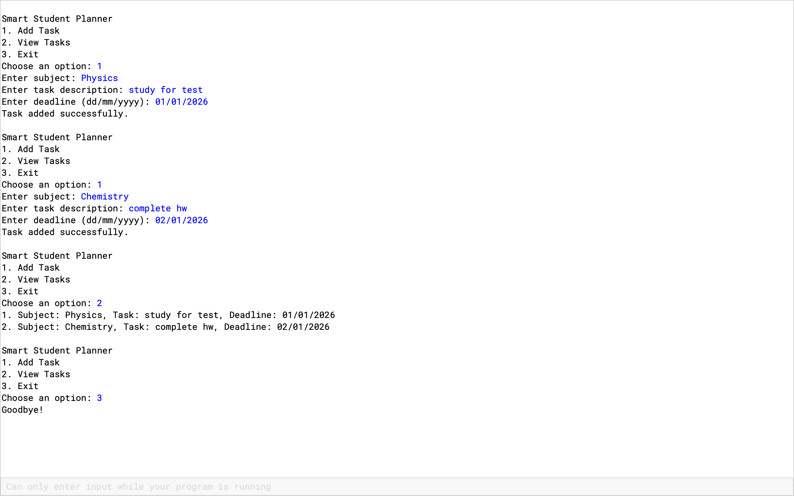

Smart Student Planner

This is a Java-based console application that helps students manage their academic tasks.
Users can add tasks with subject names and deadlines, view all tasks, and store them permanently using file handling.

Features
- Add new tasks
- View existing tasks
- Persistent storage using a text file

Technologies Used
- Java
- Object-Oriented Programming
- File Handling

What I Learned
- Designing classes and objects
- Working with files in Java
- Structuring a complete Java project

Future Improvements
- Graphical user interface
- Task priority system
- Reminder notifications
## Sample Program Output

Here is a sample screenshot showing how tasks are added and displayed:

